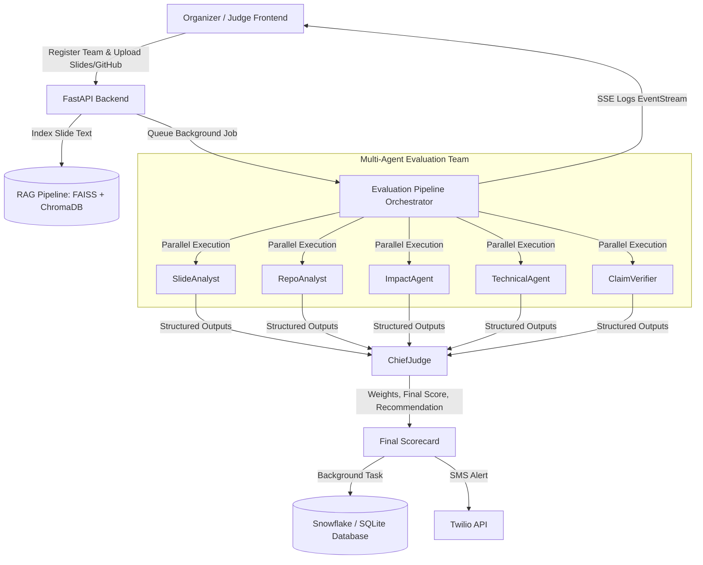

# EvalAI — Full-Stack AI Hackathon Evaluation System

EvalAI is a full-stack, AI-powered hackathon project evaluation platform that helps organizers and judges grade submissions fast, credibly, and with full defensibility. The system ingests team registrations (including slide texts/files and GitHub URLs), triggers a multi-agent orchestration pipeline running in parallel, verifies claims, checks for cross-project similarity, and outputs structured, weighted scorecards with an audit log.

---

## 🏗️ Architecture & Flow



---

## 🚀 Key Features

1. **Multi-Agent Evaluation**: Orchestrated using CrewAI agents powered by Llama-3.3-70b-versatile via Groq.
2. **Hybrid RAG**: Slide content is indexed into both FAISS (dense embeddings) and ChromaDB to support contextual agent queries.
3. **Cross-Project Similarity Engine**: Pairwise cosine similarity checks on mean embeddings to flag potential copycats or code reuse.
4. **Claim Verifier Agent**: Extracts quantitative/superlative statements from presentations and scans the codebase for evidence, labeling claims as *Verified*, *Partial*, or *Unverified*.
5. **Dynamic Scoring & Rubrics**: Live adjustments to rubric weights (must sum to 100) are immediately recalculated.
6. **Defensible Audit Trail**: Complete log of raw prompts, raw LLM completions, and background tasks. Supports CSV export.
7. **Blind Mode Support**: Sanitizes prompts and displays pseudonyms (e.g. `Team 01`) to eliminate judges' bias.
8. **Real-time Streaming**: SSE connection logs agent progress live with terminal-like feedback and status animations.

---

## 🛠️ Directory Structure

```
EvalAI/
├── backend/
│   ├── agents/            # CrewAI agent definitions
│   │   ├── __init__.py
│   │   ├── chief_judge.py
│   │   ├── claim_verifier.py
│   │   ├── impact_agent.py
│   │   ├── repo_analyst.py
│   │   ├── slide_analyst.py
│   │   └── technical_agent.py
│   ├── integrations/      # Integrations with GitHub, Snowflake, Twilio
│   │   ├── __init__.py
│   │   ├── github_client.py
│   │   ├── snowflake_client.py
│   │   └── twilio_client.py
│   ├── models/            # Pydantic schemas and validation
│   │   ├── __init__.py
│   │   └── schemas.py
│   ├── pipeline/          # RAG, similarity check, and Crew orchestrator
│   │   ├── __init__.py
│   │   ├── crew_runner.py
│   │   ├── rag.py
│   │   └── similarity.py
│   ├── config.py          # App configuration loading
│   └── main.py            # FastAPI main entrypoint
├── data/                  # SQLite DB & vector indexes
│   ├── indexes/
│   └── uploads/
├── frontend/              # Single-page application frontend
│   ├── css/
│   │   └── main.css
│   ├── js/
│   │   ├── app.js
│   │   ├── charts.js
│   │   └── eval.js
│   └── index.html
├── .env.example
├── requirements.txt
└── README.md
```

---

## ⚡ Setup & Installation

### 1. Prerequisites
- **Python 3.11+**
- **Git**

### 2. Configure Environment
Copy `.env.example` to `.env` and fill in the secrets:
```bash
cp .env.example .env
```
Key configuration values include:
- `GROQ_API_KEY`: Groq Cloud API key (Required for LLM evaluations).
- `GITHUB_TOKEN`: GitHub personal access token (Required for RepoAnalyst).
- **Snowflake Database (Optional)**: If values are left blank, EvalAI automatically defaults to SQLite (`data/evalai.db`).
- **Twilio SMS (Optional)**: Toggled off by default unless configured.

### 3. Install Dependencies
It is highly recommended to run in a virtual environment:
```bash
# Create virtual environment
py -m venv .venv
# Activate virtual environment
.venv\Scripts\activate

# Install requirements
pip install -r requirements.txt
```

---

## 🚦 Running the Application

### 1. Start the Backend API
Run the FastAPI server using Uvicorn:
```bash
uvicorn backend.main:app --reload --port 8000
```
- Open [http://localhost:8000/docs](http://localhost:8000/docs) in your browser to inspect the Interactive Swagger API documentation.

### 2. Serve the Frontend App
Serve the `frontend/` directory using any static web server:
```bash
# Using Python
python -m http.server 3000 --directory frontend/

# Or using Node.js/npx
npx serve -l 3000 frontend/
```
Open [http://localhost:3000](http://localhost:3000) to access the SPA.

---

## 🧪 Testing the Application

### 1. Verification Checklist
- **Health Check**: `GET http://localhost:8000/health` should return a list of active integrations and overall status.
- **Rubrics**: Change weights under Rubrics Config tab. Weights must sum to 100%.
- **Evaluation Job**: Register a team, upload slides, input their GitHub repo, and hit **Evaluate**. Watch the agent workflow update live!
